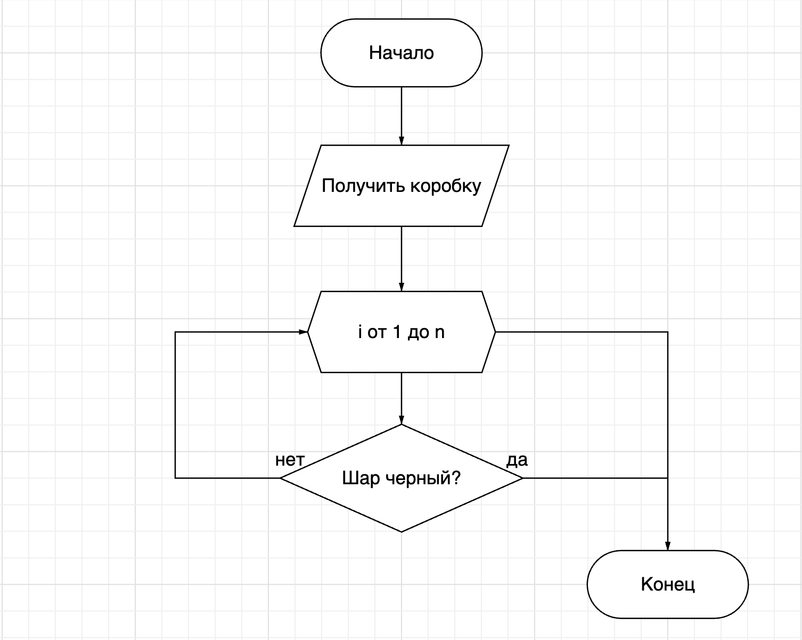

# Тестовое задание "Integer"

<details open>
  <summary>Оглавление</summary>
  <ul>
    <li><a href="#настройка">Настройка</a></li>
    <li><a href="#требования">Требования</a></li>
    <li><a href="#запуск">Запуск</a></li>
  </ul>
</details>


## [Настройка](#настройка)

Настройка окружения и установка зависимостей:

```bash
python -m venv venv
source venv/scripts/activate
pip install -r requirements.txt
```

## [Требования](#требования)

### Основные требования:

- [x] Описать свойства, методы (процедуры, функции), атрибуты какого-либо абстрактного класса. С применением дочерних и родительских классов. За основу может быть взят любой абстрактный объект. Например, автомобиль, мобильные телефоны, животные и т.д
- [x] Нарисовать блок схему поиска черного шара в коробке с белыми шарами
- [x] Написать программу по блок схеме с шарами (использование массивов с рандомным наполнением, использование функции ввода и вывода) на любом языке программирования.
- [x] Загрузить в MS SQL данные из таблицы MS Excel (файл во вложении).
На основании данной таблицы подготовить следующие выборки в формате view sql:
    - Показать всех рождённых в СССР, имеющих оценку не ниже «3» по информатике
    - Вывести список «Топ студентов», имеющих отлично по двум дисциплинам
    - Вывести информацию о количестве студентов на каждом из курсов
    - [] Вывести список студентов, сумма цифр в дате рождения у которых меньше 50.
    29.05.1999 = 2 + 9 + 0 + 5 + 1 + 9 + 9 + 9 + 9 = 53

## [Запуск](#запуск)

### Решение с описанием класса представлено в [oop.py](solutions/oop.py):
```bash
python ./solutions/oop.py
```

### Реализация поиска черного шара в коробке находится в [search_for_black_ball.py](solutions/search_for_black_ball.py):
```bash
python ./solutions/search_for_black_ball.py
```

### Блок схема поиска:


### Загрузка данных в MS SQL описана в пакете [mssql](solutions/mssql/)
Развернуть сервер БД можно с помощью контейнера:
```bash
docker-compose -f ./solutions/mssql/docker-compose.yml up -d
```
Чтобы получить результаты выборок необходимо вызвать модуль [main.py](solutions/mssql/main.py):
```bash
python ./solutions/mssql/main.py
```
